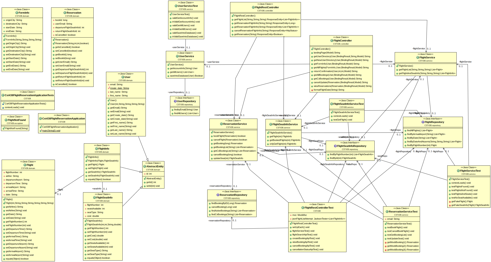
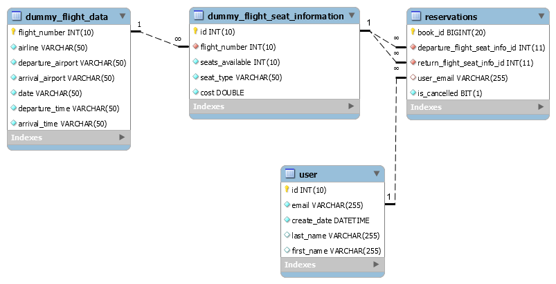

This project for CST438 Software Engineering 2020.
<br>

Contributors:<br>
Austin Ah Loo<br>
Mikie Reed<br>
Mitchell Saunders<br>
Nicholas Saunders<br>
<br>
This service is a flight reservation program that is accessed through forms by Spring Boot HTML controller or to be accessed through a REST controller given an API call(s). Additional Info over local and remote deployment of the service is provided. Documentation regarding database design along with EER diagram is found within the projects 'MySQL_Scripts' directory.

Deployment Site: https://cst438flightservice.herokuapp.com/

**UML DIAGRAM** <br>



**DATABASE DESIGN** <br>



**HOW TO USE API**
>Note: The bolded phrases are the parts that need to be changed. For testing and production, proposes, examples working within provided demos are working data.
Acceptable Cities to be used are: **Denver**, **Los Angeles**. Other cities exist within the database such as **Boston**, **New York**, and **Hawaii**, but your results may vary as not all cities are completely designed to work together. Date range from **08-18-2020** to **08-22-2020** are the valid for searching. Due to the limited scope of the test data within the database, this is all that can be provided. Demo results below are for example only, your results may vary based on your inputs.

**TO SEARCH FOR ___ONE___ FLIGHT**

To retrieve flight data for **one** direction, follow the following url scheme locally:
>localhost:8080/api/FlightDate/**08-18-2020**/DepartureCity/**Denver**/ArrivalCity/**Los Angeles**

API data is returned in the following format (shown by sample data):

```json
[{"id":0,
    "flight":
        {"flightNumber":1,"airline":"Fun Fliers","departureAirport":"Denver","departureTime":"10:00 AM","arrivalAirport":"Los Angeles","arrivalTime":"12:00PM","date":"8/18/2020"},
    "seatInfo":
        {"id":512,"flightNumber":1,"seatsAvailable":45,"seatType":"economy","cost":19.99}},
{"id":0,
    "flight":
        {"flightNumber":1,"airline":"Fun Fliers","departureAirport":"Denver","departureTime":"10:00 AM","arrivalAirport":"Los Angeles","arrivalTime":"12:00PM","date":"8/18/2020"},
    "seatInfo":
        {"id":647,"flightNumber":1,"seatsAvailable":52,"seatType":"luxury","cost":29.99}},
{"id":0,
    "flight":
        {"flightNumber":4,"airline":"Wacky Wings","departureAirport":"Denver","departureTime":"10:00 AM","arrivalAirport":"Los Angeles","arrivalTime":"12:00 PM","date":"8/18/2020"},
    "seatInfo":
        {"id":515,"flightNumber":4,"seatsAvailable":35,"seatType":"economy","cost":25.99}},
{"id":0,
    "flight":
        {"flightNumber":4,"airline":"Wacky Wings","departureAirport":"Denver","departureTime":"10:00 AM","arrivalAirport":"Los Angeles","arrivalTime":"12:00 PM","date":"8/18/2020"},
    "seatInfo":
        {"id":650,"flightNumber":4,"seatsAvailable":35,"seatType":"luxury","cost":38.99}},
{"id":0,
    "flight":
        {"flightNumber":7,"airline":"Space Y","departureAirport":"Denver","departureTime":"10:00 AM","arrivalAirport":"Los Angeles","arrivalTime":"12:00 PM","date":"8/18/2020"},
    "seatInfo":
        {"id":518,"flightNumber":7,"seatsAvailable":70,"seatType":"economy","cost":99.99}},
{"id":0,
    "flight":
        {"flightNumber":7,"airline":"Space Y","departureAirport":"Denver","departureTime":"10:00 AM","arrivalAirport":"Los Angeles","arrivalTime":"12:00 PM","date":"8/18/2020"},
    "seatInfo":
        {"id":653,"flightNumber":7,"seatsAvailable":70,"seatType":"luxury","cost":149.99}},
{"id":0,
    "flight":
        {"flightNumber":10,"airline":"Fun Fliers","departureAirport":"Denver","departureTime":"1:00 PM","arrivalAirport":"Los Angeles","arrivalTime":"3:00 PM","date":"8/18/2020"},
    "seatInfo":
        {"id":521,"flightNumber":10,"seatsAvailable":6,"seatType":"economy","cost":21.24}},
{"id":0,
    "flight":
        {"flightNumber":10,"airline":"Fun Fliers","departureAirport":"Denver","departureTime":"1:00 PM","arrivalAirport":"Los Angeles","arrivalTime":"3:00 PM","date":"8/18/2020"},
    "seatInfo":
        {"id":656,"flightNumber":10,"seatsAvailable":4,"seatType":"luxury","cost":31.86}},
{"id":0,
    "flight":
        {"flightNumber":13,"airline":"Wacky Wings","departureAirport":"Denver","departureTime":"1:00 PM","arrivalAirport":"Los Angeles","arrivalTime":"3:00 PM","date":"8/18/2020"},
    "seatInfo":
        {"id":524,"flightNumber":13,"seatsAvailable":11,"seatType":"economy","cost":23.99}},
{"id":0,
    "flight":
        {"flightNumber":13,"airline":"Wacky Wings","departureAirport":"Denver","departureTime":"1:00 PM","arrivalAirport":"Los Angeles","arrivalTime":"3:00 PM","date":"8/18/2020"},
    "seatInfo":
        {"id":659,"flightNumber":13,"seatsAvailable":11,"seatType":"luxury","cost":35.99}},
{"id":0,
    "flight":
        {"flightNumber":16,"airline":"Space Y","departureAirport":"Denver","departureTime":"1:00 PM","arrivalAirport":"Los Angeles","arrivalTime":"3:00 PM","date":"8/18/2020"},
    "seatInfo":
        {"id":527,"flightNumber":16,"seatsAvailable":15,"seatType":"economy","cost":89.95}},
{"id":0,
    "flight":
        {"flightNumber":16,"airline":"Space Y","departureAirport":"Denver","departureTime":"1:00 PM","arrivalAirport":"Los Angeles","arrivalTime":"3:00 PM","date":"8/18/2020"},
    "seatInfo":
        {"id":662,"flightNumber":16,"seatsAvailable":15,"seatType":"luxury","cost":134.93}},
{"id":0,
    "flight":
        {"flightNumber":19,"airline":"Fun Fliers","departureAirport":"Denver","departureTime":"4:00 PM","arrivalAirport":"Los Angeles","arrivalTime":"6:00 PM","date":"8/18/2020"},
    "seatInfo":
        {"id":530,"flightNumber":19,"seatsAvailable":39,"seatType":"economy","cost":18.66}},
{"id":0,
    "flight":
        {"flightNumber":19,"airline":"Fun Fliers","departureAirport":"Denver","departureTime":"4:00 PM","arrivalAirport":"Los Angeles","arrivalTime":"6:00 PM","date":"8/18/2020"},
    "seatInfo":
        {"id":665,"flightNumber":19,"seatsAvailable":39,"seatType":"luxury","cost":27.99}},
{"id":0,
    "flight":
        {"flightNumber":22,"airline":"Wacky Wings","departureAirport":"Denver","departureTime":"4:00 PM","arrivalAirport":"Los Angeles","arrivalTime":"6:00 PM","date":"8/18/2020"},
    "seatInfo":
        {"id":533,"flightNumber":22,"seatsAvailable":47,"seatType":"economy","cost":35.55}},
{"id":0,
    "flight":
        {"flightNumber":22,"airline":"Wacky Wings","departureAirport":"Denver","departureTime":"4:00 PM","arrivalAirport":"Los Angeles","arrivalTime":"6:00 PM","date":"8/18/2020"},
    "seatInfo":
        {"id":668,"flightNumber":22,"seatsAvailable":47,"seatType":"luxury","cost":53.33}},
{"id":0,
    "flight":
        {"flightNumber":25,"airline":"Space Y","departureAirport":"Denver","departureTime":"4:00 PM","arrivalAirport":"Los Angeles","arrivalTime":"6:00 PM","date":"8/18/2020"},
    "seatInfo":
        {"id":536,"flightNumber":25,"seatsAvailable":99,"seatType":"economy","cost":108.56}},
{"id":0,
    "flight":
        {"flightNumber":25,"airline":"Space Y","departureAirport":"Denver","departureTime":"4:00 PM","arrivalAirport":"Los Angeles","arrivalTime":"6:00 PM","date":"8/18/2020"},
    "seatInfo":
        {"id":671,"flightNumber":25,"seatsAvailable":99,"seatType":"luxury","cost":162.84}}]
```

API Failure (or empty search result):
>Returned 404 status.

**TO BOOK A FLIGHT**

Requires **two** seatInfo.id from the previous API call.Meaning, you will have to search for flights total of **two** times for a round trip. Program only handles round trip at this time. One for departure to destination, and one from destination back to origin. When these two ID's are provided into the API, a singular value will be returned. This is your BookingID. Store this with your user as you will need this for all things related to the booking.

Local:
> localhost:8080/api/SeatID1/**512**/SeatID2/**647**

API data is returned in the following format (shown by sample data)
>6

API Failure (nothing booked. Invalid seat ID?): 

>Returned 404 status.

**TO VIEW FLIGHT DETAILS BY BOOKINGID**

Using the Previous API's bookingID that was provided, you can view the details of that flight.

Local:
>localhost:8080/api/BookingID/**6**

API data is returned in the following format (shown by sample data). This is the same format as the first API.

```json
[{"id":0,
    "flight":{"flightNumber":1,"airline":"Fun Fliers","departureAirport":"Denver","departureTime":"10:00 AM","arrivalAirport":"Los Angeles","arrivalTime":"12:00 PM","date":"8/18/2020"},
    "seatInfo":{"id":512,"flightNumber":1,"seatsAvailable":44,"seatType":"economy","cost":19.99}},
{"id":0,
    "flight":{"flightNumber":1,"airline":"Fun Fliers","departureAirport":"Denver","departureTime":"10:00 AM","arrivalAirport":"Los Angeles","arrivalTime":"12:00 PM","date":"8/18/2020"},
    "seatInfo":{"id":647,"flightNumber":1,"seatsAvailable":51,"seatType":"luxury","cost":29.99}}]
```

API Failure (Invalid booking ID):
>Returned status 404.

**TO CANCEL EXISTING BOOKINGID**

You can cancel your booking using your bookingID.

>localhost:8080/api/Cancel/BookingID/**6**

Valid API result:
>Returned status 200.

Invalid API result(from a non-existing booking id):
>Returned status 404.

**TO VIEW CANCELLED STATUS**

You can view your booking's cancellation status using your bookingID.

>localhost:8080/api/CancellationStatus/BookingID/**6**

Valid API result:
>Returned status 200. plus boolean (true = cancelled, false = not cancelled)

Invalid API result(from a non-existing booking id):
>Returned status 404.
